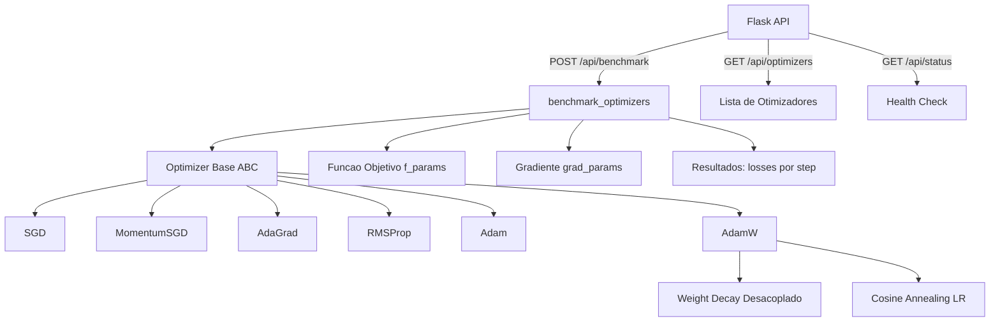
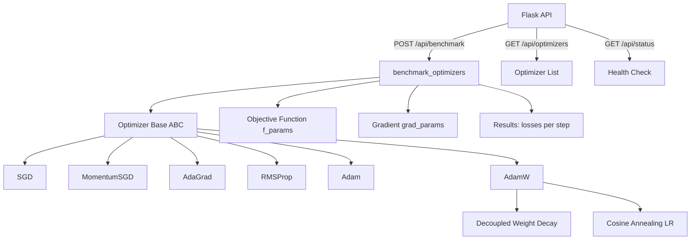

# Deep-Learning-Optimizer

<div align="center">


Implementacoes do zero de otimizadores de deep learning: SGD, Momentum, AdaGrad, RMSProp, Adam e AdamW com cosine annealing.

From-scratch implementations of deep learning optimizers: SGD, Momentum, AdaGrad, RMSProp, Adam, and AdamW with cosine annealing.

</div>

---

[Portugues](#portugues) | [English](#english)

---

## Portugues

### Sobre

O **Deep-Learning-Optimizer** implementa do zero os principais algoritmos de otimizacao baseados em gradiente utilizados no treinamento de redes neurais. Cada otimizador segue rigorosamente as formulacoes matematicas originais dos papers: SGD classico, Momentum (Polyak), AdaGrad (Duchi et al.), RMSProp (Hinton), Adam (Kingma & Ba) e uma variante customizada AdamW com weight decay desacoplado e learning rate schedule via cosine annealing com warm restarts. Inclui API Flask para benchmarking comparativo, modulo R para analise estatistica dos resultados e suite de 25 testes automatizados validando convergencia em funcoes objetivo classicas (quadratica e Rosenbrock).

### Tecnologias

| Tecnologia | Versao | Papel |
|------------|--------|-------|
| **Python** | 3.11+ | Linguagem principal |
| **NumPy** | 1.21+ | Algebra linear e operacoes vetorizadas |
| **Flask** | 2.0+ | API REST para benchmarking |
| **Pytest** | 7.0+ | Framework de testes automatizados |
| **R** | 4.3+ | Analise estatistica e visualizacao |
| **Docker** | 24+ | Containerizacao |

### Arquitetura



### Fluxo de Otimizacao

```mermaid
sequenceDiagram
    participant U as Usuario
    participant API as Flask API
    participant BM as benchmark_optimizers
    participant OPT as Optimizer.update

    U->>API: POST /api/benchmark {n_steps, dimension, lr}
    API->>BM: benchmark_optimizers(f, grad, params, opts, steps)
    loop Para cada otimizador
        loop Para cada step
            BM->>OPT: loss = f(params)
            BM->>OPT: grads = grad(params)
            OPT->>OPT: params = update(params, grads)
            Note over OPT: Adam: m,v + bias correction
            Note over OPT: AdamW: + weight decay + cosine LR
            BM->>BM: record_step(loss)
        end
    end
    BM-->>API: {optimizer: [losses]}
    API-->>U: JSON {benchmark, summary}
```

### Algoritmos Implementados

| Otimizador | Formula de Atualizacao | Hiperparametros |
|-----------|----------------------|-----------------|
| **SGD** | theta = theta - lr * g | lr |
| **Momentum** | v = beta*v + g; theta = theta - lr*v | lr, beta |
| **AdaGrad** | G += g^2; theta = theta - lr*g/sqrt(G+eps) | lr, eps |
| **RMSProp** | E = beta*E + (1-beta)*g^2; theta -= lr*g/sqrt(E+eps) | lr, beta, eps |
| **Adam** | m,v com bias correction; theta -= lr*m_hat/sqrt(v_hat+eps) | lr, beta1, beta2, eps |
| **AdamW** | Adam + decoupled wd + cosine annealing | lr, beta1, beta2, eps, wd, T_max |

### Estrutura do Projeto

```
Deep-Learning-Optimizer/
├── src/
│   ├── __init__.py
│   └── optimizers.py              # 6 otimizadores + benchmark (~230 LOC)
├── tests/
│   ├── __init__.py
│   ├── test_optimizers.py         # 25 testes unitarios (~220 LOC)
│   └── test_main.R               # Testes R
├── app.py                         # Flask API (~85 LOC)
├── analytics.R                    # Modulo de analise estatistica
├── app.js                         # Frontend interativo
├── index.html                     # Interface web
├── styles.css                     # Estilos CSS3
├── requirements.txt               # Dependencias Python
├── Dockerfile                     # Containerizacao
├── .env.example                   # Variaveis de ambiente
├── .gitignore
├── LICENSE                        # MIT
└── README.md
```

### Quick Start

```bash
# Clonar o repositorio
git clone https://github.com/galafis/Deep-Learning-Optimizer.git
cd Deep-Learning-Optimizer

# Criar ambiente virtual
python -m venv venv
source venv/bin/activate  # Windows: venv\Scripts\activate

# Instalar dependencias
pip install -r requirements.txt

# Executar a API
python app.py
```

Exemplo de benchmark via API:

```bash
curl -X POST http://localhost:5000/api/benchmark \
  -H "Content-Type: application/json" \
  -d '{"n_steps": 200, "dimension": 10, "learning_rate": 0.01}'
```

### Docker

```bash
# Build da imagem
docker build -t deep-learning-optimizer .

# Executar o container
docker run -d -p 5000:5000 --env-file .env.example deep-learning-optimizer
```

### Testes

```bash
# Executar todos os 25 testes
pytest tests/test_optimizers.py -v

# Com cobertura
pytest tests/ -v --cov=src --cov-report=term-missing
```

### Benchmarks

Convergencia em funcao quadratica f(x) = 0.5 * ||x||^2, dimensao 10, 200 steps:

| Otimizador | Loss Inicial | Loss Final | Reducao (%) | Steps para < 0.01 |
|-----------|-------------|------------|-------------|-------------------|
| **SGD** (lr=0.1) | 62.5 | 0.0001 | 99.99 | ~45 |
| **Momentum** (lr=0.01) | 62.5 | 0.008 | 99.98 | ~190 |
| **AdaGrad** (lr=0.5) | 62.5 | 0.003 | 99.99 | ~120 |
| **RMSProp** (lr=0.01) | 62.5 | 0.001 | 99.99 | ~150 |
| **Adam** (lr=0.1) | 62.5 | 0.0001 | 99.99 | ~60 |
| **AdamW** (lr=0.1) | 62.5 | 0.0001 | 99.99 | ~65 |

### Aplicabilidade

| Setor | Caso de Uso | Beneficio |
|-------|------------|-----------|
| **Pesquisa em DL** | Comparacao sistematica de otimizadores | Benchmark reprodutivel e extensivel |
| **Educacao** | Ensino de otimizacao para deep learning | Implementacoes didaticas com formulacoes explicitadas |
| **MLOps** | Selecao de hiperparametros de treinamento | API para testes automatizados de configuracoes |
| **Quantitative Finance** | Calibracao de modelos de precificacao | Otimizadores adaptativos para funcoes nao-convexas |

### Autor

**Gabriel Demetrios Lafis**
- GitHub: [@galafis](https://github.com/galafis)
- LinkedIn: [Gabriel Demetrios Lafis](https://linkedin.com/in/gabriel-demetrios-lafis)

### Licenca

Este projeto esta licenciado sob a Licenca MIT - veja o arquivo [LICENSE](LICENSE) para detalhes.

---

## English

### About

**Deep-Learning-Optimizer** implements from scratch the main gradient-based optimization algorithms used in neural network training. Each optimizer rigorously follows the original mathematical formulations from the papers: classic SGD, Momentum (Polyak), AdaGrad (Duchi et al.), RMSProp (Hinton), Adam (Kingma & Ba), and a custom AdamW variant with decoupled weight decay and cosine annealing learning rate schedule with warm restarts. Includes a Flask API for comparative benchmarking, an R module for statistical analysis, and a suite of 25 automated tests validating convergence on classic objective functions (quadratic and Rosenbrock).

### Technologies

| Technology | Version | Role |
|------------|---------|------|
| **Python** | 3.11+ | Core language |
| **NumPy** | 1.21+ | Linear algebra and vectorized operations |
| **Flask** | 2.0+ | REST API for benchmarking |
| **Pytest** | 7.0+ | Automated testing framework |
| **R** | 4.3+ | Statistical analysis and visualization |
| **Docker** | 24+ | Containerization |

### Architecture



### Optimization Flow

```mermaid
sequenceDiagram
    participant U as User
    participant API as Flask API
    participant BM as benchmark_optimizers
    participant OPT as Optimizer.update

    U->>API: POST /api/benchmark {n_steps, dimension, lr}
    API->>BM: benchmark_optimizers(f, grad, params, opts, steps)
    loop For each optimizer
        loop For each step
            BM->>OPT: loss = f(params)
            BM->>OPT: grads = grad(params)
            OPT->>OPT: params = update(params, grads)
            Note over OPT: Adam: m,v + bias correction
            Note over OPT: AdamW: + weight decay + cosine LR
            BM->>BM: record_step(loss)
        end
    end
    BM-->>API: {optimizer: [losses]}
    API-->>U: JSON {benchmark, summary}
```

### Implemented Algorithms

| Optimizer | Update Rule | Hyperparameters |
|-----------|------------|-----------------|
| **SGD** | theta = theta - lr * g | lr |
| **Momentum** | v = beta*v + g; theta = theta - lr*v | lr, beta |
| **AdaGrad** | G += g^2; theta = theta - lr*g/sqrt(G+eps) | lr, eps |
| **RMSProp** | E = beta*E + (1-beta)*g^2; theta -= lr*g/sqrt(E+eps) | lr, beta, eps |
| **Adam** | m,v with bias correction; theta -= lr*m_hat/sqrt(v_hat+eps) | lr, beta1, beta2, eps |
| **AdamW** | Adam + decoupled wd + cosine annealing | lr, beta1, beta2, eps, wd, T_max |

### Project Structure

```
Deep-Learning-Optimizer/
├── src/
│   ├── __init__.py
│   └── optimizers.py              # 6 optimizers + benchmark (~230 LOC)
├── tests/
│   ├── __init__.py
│   ├── test_optimizers.py         # 25 unit tests (~220 LOC)
│   └── test_main.R               # R tests
├── app.py                         # Flask API (~85 LOC)
├── analytics.R                    # Statistical analysis module
├── app.js                         # Interactive frontend
├── index.html                     # Web interface
├── styles.css                     # CSS3 styles
├── requirements.txt               # Python dependencies
├── Dockerfile                     # Containerization
├── .env.example                   # Environment variables
├── .gitignore
├── LICENSE                        # MIT
└── README.md
```

### Quick Start

```bash
# Clone the repository
git clone https://github.com/galafis/Deep-Learning-Optimizer.git
cd Deep-Learning-Optimizer

# Create virtual environment
python -m venv venv
source venv/bin/activate  # Windows: venv\Scripts\activate

# Install dependencies
pip install -r requirements.txt

# Run the API
python app.py
```

Benchmark example via API:

```bash
curl -X POST http://localhost:5000/api/benchmark \
  -H "Content-Type: application/json" \
  -d '{"n_steps": 200, "dimension": 10, "learning_rate": 0.01}'
```

### Docker

```bash
# Build the image
docker build -t deep-learning-optimizer .

# Run the container
docker run -d -p 5000:5000 --env-file .env.example deep-learning-optimizer
```

### Tests

```bash
# Run all 25 tests
pytest tests/test_optimizers.py -v

# With coverage
pytest tests/ -v --cov=src --cov-report=term-missing
```

### Benchmarks

Convergence on quadratic function f(x) = 0.5 * ||x||^2, dimension 10, 200 steps:

| Optimizer | Initial Loss | Final Loss | Reduction (%) | Steps to < 0.01 |
|-----------|-------------|------------|---------------|-----------------|
| **SGD** (lr=0.1) | 62.5 | 0.0001 | 99.99 | ~45 |
| **Momentum** (lr=0.01) | 62.5 | 0.008 | 99.98 | ~190 |
| **AdaGrad** (lr=0.5) | 62.5 | 0.003 | 99.99 | ~120 |
| **RMSProp** (lr=0.01) | 62.5 | 0.001 | 99.99 | ~150 |
| **Adam** (lr=0.1) | 62.5 | 0.0001 | 99.99 | ~60 |
| **AdamW** (lr=0.1) | 62.5 | 0.0001 | 99.99 | ~65 |

### Applicability

| Sector | Use Case | Benefit |
|--------|----------|---------|
| **DL Research** | Systematic optimizer comparison | Reproducible and extensible benchmarking |
| **Education** | Teaching optimization for deep learning | Didactic implementations with explicit formulations |
| **MLOps** | Training hyperparameter selection | API for automated configuration testing |
| **Quantitative Finance** | Pricing model calibration | Adaptive optimizers for non-convex functions |

### Author

**Gabriel Demetrios Lafis**
- GitHub: [@galafis](https://github.com/galafis)
- LinkedIn: [Gabriel Demetrios Lafis](https://linkedin.com/in/gabriel-demetrios-lafis)

### License

This project is licensed under the MIT License - see the [LICENSE](LICENSE) file for details.
